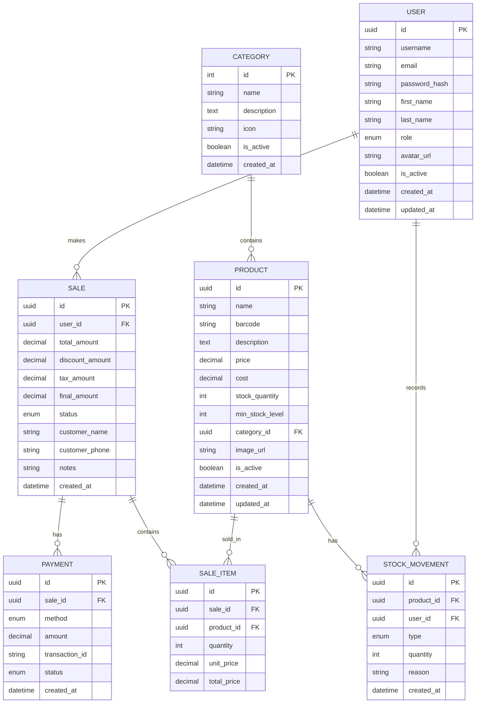

# معمارية النظام - CP'S Enterprise POS
## System Architecture Documentation

**الإصدار:** 2.0.0  
**آخر تحديث:** 14 فبراير 2026

---

## 1. نظرة عامة على المعمارية

### 1.1 المعمارية المستهدفة: Clean Architecture + Microservices-Ready

```
┌─────────────────────────────────────────────────────────────────────────────┐
│                         CP'S Enterprise POS                                  │
│                    Clean Architecture Layers                                 │
├─────────────────────────────────────────────────────────────────────────────┤
│                                                                              │
│  ┌─────────────────────────────────────────────────────────────────────┐    │
│  │                        Presentation Layer                            │    │
│  │  ┌─────────────┐  ┌─────────────┐  ┌─────────────┐  ┌─────────────┐ │    │
│  │  │   React     │  │   Mobile    │  │   Admin     │  │   POS       │ │    │
│  │  │   Web App   │  │   App       │  │   Panel     │  │   Terminal  │ │    │
│  │  └─────────────┘  └─────────────┘  └─────────────┘  └─────────────┘ │    │
│  └─────────────────────────────────────────────────────────────────────┘    │
│                                    │                                         │
│                                    ▼                                         │
│  ┌─────────────────────────────────────────────────────────────────────┐    │
│  │                          API Gateway                                 │    │
│  │                    (Nginx / Kong / Traefik)                          │    │
│  │         • Rate Limiting • Authentication • Load Balancing            │    │
│  └─────────────────────────────────────────────────────────────────────┘    │
│                                    │                                         │
│                                    ▼                                         │
│  ┌─────────────────────────────────────────────────────────────────────┐    │
│  │                        Application Layer                             │    │
│  │  ┌─────────────────────────────────────────────────────────────┐    │    │
│  │  │                    FastAPI Application                       │    │    │
│  │  │  ┌──────────┐ ┌──────────┐ ┌──────────┐ ┌──────────┐       │    │    │
│  │  │  │  Auth    │ │ Products │ │  Sales   │ │ Reports  │       │    │    │
│  │  │  │  Module  │ │  Module  │ │  Module  │ │  Module  │       │    │    │
│  │  │  └──────────┘ └──────────┘ └──────────┘ └──────────┘       │    │    │
│  │  └─────────────────────────────────────────────────────────────┘    │    │
│  └─────────────────────────────────────────────────────────────────────┘    │
│                                    │                                         │
│                                    ▼                                         │
│  ┌─────────────────────────────────────────────────────────────────────┐    │
│  │                         Domain Layer                                 │    │
│  │  ┌──────────┐ ┌──────────┐ ┌──────────┐ ┌──────────┐ ┌──────────┐   │    │
│  │  │ Entities │ │  Value   │ │ Domain   │ │ Domain   │ │ Domain   │   │    │
│  │  │          │ │ Objects  │ │ Services │ │ Events   │ │ Policies │   │    │
│  │  └──────────┘ └──────────┘ └──────────┘ └──────────┘ └──────────┘   │    │
│  └─────────────────────────────────────────────────────────────────────┘    │
│                                    │                                         │
│                                    ▼                                         │
│  ┌─────────────────────────────────────────────────────────────────────┐    │
│  │                    Infrastructure Layer                              │    │
│  │  ┌──────────┐ ┌──────────┐ ┌──────────┐ ┌──────────┐ ┌──────────┐   │    │
│  │  │   DB     │ │  Cache   │ │  Queue   │ │ Storage  │ │ External │   │    │
│  │  │  Repos   │ │  Repos   │ │  Repos   │ │  Repos   │ │ Services │   │    │
│  │  └──────────┘ └──────────┘ └──────────┘ └──────────┘ └──────────┘   │    │
│  └─────────────────────────────────────────────────────────────────────┘    │
│                                    │                                         │
│                                    ▼                                         │
│  ┌─────────────────────────────────────────────────────────────────────┐    │
│  │                      External Services                               │    │
│  │  ┌──────────┐ ┌──────────┐ ┌──────────┐ ┌──────────┐ ┌──────────┐   │    │
│  │  │PostgreSQL│ │  Redis   │ │ RabbitMQ │ │  MinIO   │  Payment  │   │    │
│  │  │          │ │          │ │          │ │          │  Gateway  │   │    │
│  │  └──────────┘ └──────────┘ └──────────┘ └──────────┘ └──────────┘   │    │
│  └─────────────────────────────────────────────────────────────────────┘    │
│                                                                              │
└─────────────────────────────────────────────────────────────────────────────┘
```

---

## 2. تدفق البيانات (Data Flow)

### 2.1 تدفق معاملة البيع (Sale Transaction Flow)

```
┌─────────┐     ┌─────────┐     ┌─────────┐     ┌─────────┐     ┌─────────┐
│  Client │────▶│  Nginx  │────▶│ FastAPI │────▶│ Service │────▶│   DB    │
│   (POS) │     │ Gateway │     │  API    │     │  Layer  │     │   Repo  │
└─────────┘     └─────────┘     └─────────┘     └─────────┘     └─────────┘
     │                               │               │               │
     │                               │               │               │
     │                               ▼               ▼               │
     │                         ┌─────────┐     ┌─────────┐           │
     │                         │ Validate│────▶│ Business│           │
     │                         │ Request │     │  Logic  │           │
     │                         └─────────┘     └─────────┘           │
     │                                               │               │
     │                                               ▼               │
     │                                         ┌─────────┐           │
     │                                         │  Check  │───────────│
     │                                         │  Stock  │           │
     │                                         └─────────┘           │
     │                                               │               │
     │                                               ▼               ▼
     │                                         ┌─────────┐     ┌─────────┐
     │                                         │ Process │────▶│  Save   │
     │                                         │ Payment │     │  Sale   │
     │                                         └─────────┘     └─────────┘
     │                                               │               │
     │                                               ▼               │
     │                                         ┌─────────┐           │
     │                                         │ Update  │───────────│
     │                                         │  Stock  │           │
     │                                         └─────────┘           │
     │                                                               │
     │                                                               ▼
     │                                                         ┌─────────┐
     │                                                         │ Publish │
     │                                                         │  Event  │
     │                                                         └─────────┘
     │                                                               │
     │                                                               ▼
     │                                                         ┌─────────┐
     │                                                         │  Cache  │
     │                                                         │ Update  │
     │                                                         └─────────┘
     │                                                               │
     ▼                                                               ▼
┌─────────┐                                                 ┌─────────┐
│ Response│◀────────────────────────────────────────────────│  Return │
│  (JSON) │                                                 │  Result │
└─────────┘                                                 └─────────┘
```

---

## 3. نماذج البيانات (Data Models)

### 3.1 Entity Relationship Diagram



---

## 4. API Design

### 4.1 RESTful API Structure

```
/api/v1/
├── /auth
│   ├── POST /login
│   ├── POST /register
│   ├── POST /refresh
│   ├── POST /logout
│   └── POST /forgot-password
│
├── /users
│   ├── GET    /           (List users - Admin only)
│   ├── POST   /           (Create user - Admin only)
│   ├── GET    /{id}       (Get user)
│   ├── PUT    /{id}       (Update user)
│   ├── DELETE /{id}       (Delete user - Admin only)
│   └── GET    /me         (Get current user)
│
├── /products
│   ├── GET    /           (List products)
│   ├── POST   /           (Create product - Manager+)
│   ├── GET    /{id}       (Get product)
│   ├── PUT    /{id}       (Update product - Manager+)
│   ├── DELETE /{id}       (Delete product - Manager+)
│   ├── GET    /search     (Search products)
│   └── GET    /low-stock  (Get low stock products)
│
├── /categories
│   ├── GET    /
│   ├── POST   /           (Manager+)
│   ├── GET    /{id}
│   ├── PUT    /{id}       (Manager+)
│   └── DELETE /{id}       (Manager+)
│
├── /sales
│   ├── GET    /           (List sales)
│   ├── POST   /           (Create sale)
│   ├── GET    /{id}       (Get sale details)
│   ├── POST   /{id}/refund (Process refund)
│   └── GET    /reports    (Sales reports)
│
├── /pos
│   ├── GET    /products    (Get products for POS)
│   ├── POST   /checkout    (Process checkout)
│   ├── GET    /receipt/{id} (Get receipt)
│   └── POST   /hold        (Hold transaction)
│
├── /inventory
│   ├── GET    /movements   (Stock movements)
│   ├── POST   /adjust      (Adjust stock)
│   └── GET    /alerts      (Stock alerts)
│
└── /reports
    ├── GET    /dashboard   (Dashboard data)
    ├── GET    /sales       (Sales report)
    ├── GET    /products    (Products report)
    └── GET    /customers   (Customers report)
```

### 4.2 API Response Format

```json
{
  "success": true,
  "data": {
    // Response data
  },
  "meta": {
    "page": 1,
    "per_page": 20,
    "total": 100,
    "total_pages": 5
  },
  "message": "Operation completed successfully"
}
```

### 4.3 Error Response Format

```json
{
  "success": false,
  "error": {
    "code": "VALIDATION_ERROR",
    "message": "Invalid input data",
    "details": [
      {
        "field": "email",
        "message": "Invalid email format"
      }
    ]
  }
}
```

---

## 5. Security Architecture

### 5.1 Authentication Flow

```
┌─────────┐                              ┌─────────┐
│  Client │                              │  Server │
└────┬────┘                              └────┬────┘
     │                                         │
     │  POST /auth/login                       │
     │  {username, password}                   │
     │ ───────────────────────────────────────▶│
     │                                         │
     │                                         │ Validate credentials
     │                                         │ Generate tokens
     │                                         │
     │  {access_token, refresh_token, user}    │
     │ ◀───────────────────────────────────────│
     │                                         │
     │  Store tokens securely                  │
     │  (httpOnly cookies or secure storage)   │
     │                                         │
     │  GET /api/v1/users/me                   │
     │  Authorization: Bearer {access_token}   │
     │ ───────────────────────────────────────▶│
     │                                         │
     │                                         │ Validate JWT
     │                                         │ Extract user info
     │                                         │
     │  {user data}                            │
     │ ◀───────────────────────────────────────│
     │                                         │
     │  Token expired                          │
     │                                         │
     │  POST /auth/refresh                     │
     │  {refresh_token}                        │
     │ ───────────────────────────────────────▶│
     │                                         │
     │                                         │ Validate refresh token
     │                                         │ Generate new tokens
     │                                         │
     │  {new_access_token, new_refresh_token}  │
     │ ◀───────────────────────────────────────│
```

### 5.2 Security Layers

```
┌─────────────────────────────────────────────────────────────┐
│                    Security Layers                           │
├─────────────────────────────────────────────────────────────┤
│                                                              │
│  Layer 1: Network Security                                   │
│  ├── HTTPS/TLS 1.3                                          │
│  ├── WAF (Web Application Firewall)                         │
│  ├── DDoS Protection                                        │
│  └── IP Whitelisting                                        │
│                                                              │
│  Layer 2: Application Security                               │
│  ├── Rate Limiting                                          │
│  ├── CORS Configuration                                     │
│  ├── CSRF Protection                                        │
│  ├── XSS Prevention                                         │
│  └── SQL Injection Prevention                               │
│                                                              │
│  Layer 3: Authentication & Authorization                     │
│  ├── JWT with short expiry                                  │
│  ├── Refresh Token Rotation                                 │
│  ├── Role-Based Access Control (RBAC)                       │
│  ├── Permission-based Access                                │
│  └── MFA Support                                            │
│                                                              │
│  Layer 4: Data Security                                      │
│  ├── Encryption at Rest (AES-256)                           │
│  ├── Encryption in Transit (TLS 1.3)                        │
│  ├── PII Data Masking                                       │
│  └── Secure Key Management                                  │
│                                                              │
│  Layer 5: Audit & Monitoring                                 │
│  ├── Activity Logging                                       │
│  ├── Failed Login Attempts Tracking                         │
│  ├── Suspicious Activity Detection                          │
│  └── Security Alerts                                        │
│                                                              │
└─────────────────────────────────────────────────────────────┘
```

---

## 6. Caching Strategy

### 6.1 Multi-Level Caching

```
┌─────────────────────────────────────────────────────────────┐
│                    Caching Layers                            │
├─────────────────────────────────────────────────────────────┤
│                                                              │
│  Layer 1: Browser Cache                                      │
│  ├── Static Assets (JS, CSS, Images)                        │
│  └── Cache-Control: max-age=31536000                        │
│                                                              │
│  Layer 2: CDN Cache                                          │
│  ├── Static Files                                            │
│  └── API Responses (short TTL)                              │
│                                                              │
│  Layer 3: Application Cache (Redis)                         │
│  ├── Session Data                                            │
│  ├── User Profiles                                           │
│  ├── Product Catalog                                         │
│  └── Query Results                                           │
│                                                              │
│  Layer 4: Database Cache                                     │
│  ├── Query Cache                                             │
│  └── Connection Pooling                                     │
│                                                              │
└─────────────────────────────────────────────────────────────┘
```

### 6.2 Cache Invalidation Strategy

```python
# Cache Keys Pattern
"user:{user_id}"           # User profile - TTL: 1 hour
"product:{product_id}"     # Product details - TTL: 30 minutes
"products:list:{page}"     # Product list - TTL: 10 minutes
"category:{category_id}"   # Category data - TTL: 1 hour
"dashboard:{user_id}"      # Dashboard data - TTL: 5 minutes

# Invalidation Events
- Product update → Invalidate product:{id} + products:list:*
- User update → Invalidate user:{id}
- Sale completed → Invalidate dashboard:* + product:{id}
```

---

## 7. Background Tasks

### 7.1 Celery Task Queue

```python
# Tasks Configuration
tasks = {
    "send_email": {
        "queue": "notifications",
        "priority": "normal"
    },
    "generate_report": {
        "queue": "reports",
        "priority": "low"
    },
    "process_payment": {
        "queue": "payments",
        "priority": "high"
    },
    "sync_inventory": {
        "queue": "inventory",
        "priority": "normal",
        "schedule": "*/5 * * * *"  # Every 5 minutes
    },
    "backup_database": {
        "queue": "maintenance",
        "priority": "low",
        "schedule": "0 2 * * *"  # Daily at 2 AM
    }
}
```

---

## 8. Deployment Architecture

### 8.1 Kubernetes Deployment

```yaml
# High-Level Architecture
apiVersion: apps/v1
kind: Deployment
metadata:
  name: cps-pos-api
spec:
  replicas: 3
  strategy:
    type: RollingUpdate
    rollingUpdate:
      maxSurge: 1
      maxUnavailable: 0
  template:
    spec:
      containers:
        - name: api
          image: cps-enterprise/pos-api:latest
          resources:
            requests:
              memory: "512Mi"
              cpu: "500m"
            limits:
              memory: "1Gi"
              cpu: "1000m"
          env:
            - name: DATABASE_URL
              valueFrom:
                secretKeyRef:
                  name: db-credentials
                  key: url
            - name: REDIS_URL
              valueFrom:
                secretKeyRef:
                  name: redis-credentials
                  key: url
```

---

## 9. Monitoring & Observability

### 9.1 Metrics Collection

```
┌─────────────────────────────────────────────────────────────┐
│                    Monitoring Stack                          │
├─────────────────────────────────────────────────────────────┤
│                                                              │
│  Application Metrics (Prometheus)                           │
│  ├── Request count by endpoint                              │
│  ├── Response time (p50, p95, p99)                         │
│  ├── Error rate                                             │
│  ├── Active connections                                     │
│  └── Database query time                                    │
│                                                              │
│  Business Metrics (Custom)                                  │
│  ├── Sales per hour/day/month                               │
│  ├── Active users                                           │
│  ├── Products sold                                          │
│  └── Revenue                                                │
│                                                              │
│  Infrastructure Metrics                                     │
│  ├── CPU usage                                              │
│  ├── Memory usage                                           │
│  ├── Disk I/O                                               │
│  └── Network traffic                                        │
│                                                              │
└─────────────────────────────────────────────────────────────┘
```

### 9.2 Logging Strategy

```python
# Log Levels
DEBUG   - Development only
INFO    - General operations
WARNING - Non-critical issues
ERROR   - Errors that need attention
CRITICAL - System-critical errors

# Log Format
{
    "timestamp": "2026-02-14T10:30:00Z",
    "level": "INFO",
    "service": "cps-pos-api",
    "trace_id": "abc123",
    "user_id": "user_123",
    "message": "Sale completed",
    "context": {
        "sale_id": "sale_456",
        "amount": 150.00,
        "payment_method": "card"
    }
}
```

---

## 10. Disaster Recovery

### 10.1 Backup Strategy

```
┌─────────────────────────────────────────────────────────────┐
│                    Backup Strategy                           │
├─────────────────────────────────────────────────────────────┤
│                                                              │
│  Database Backups                                            │
│  ├── Full Backup: Daily at 2 AM UTC                         │
│  ├── Incremental: Every 4 hours                             │
│  └── WAL Archiving: Continuous                              │
│                                                              │
│  Retention Policy                                            │
│  ├── Daily backups: 7 days                                  │
│  ├── Weekly backups: 4 weeks                                │
│  └── Monthly backups: 12 months                             │
│                                                              │
│  Storage                                                     │
│  ├── Primary: AWS S3 (Same region)                          │
│  └── Secondary: AWS S3 (Different region)                   │
│                                                              │
│  Recovery Time Objectives                                    │
│  ├── RTO (Recovery Time Objective): 4 hours                 │
│  └── RPO (Recovery Point Objective): 1 hour                 │
│                                                              │
└─────────────────────────────────────────────────────────────┘
```

---

**© 2026 CP'S™ Enterprise Tech Solution L.L.C.**
